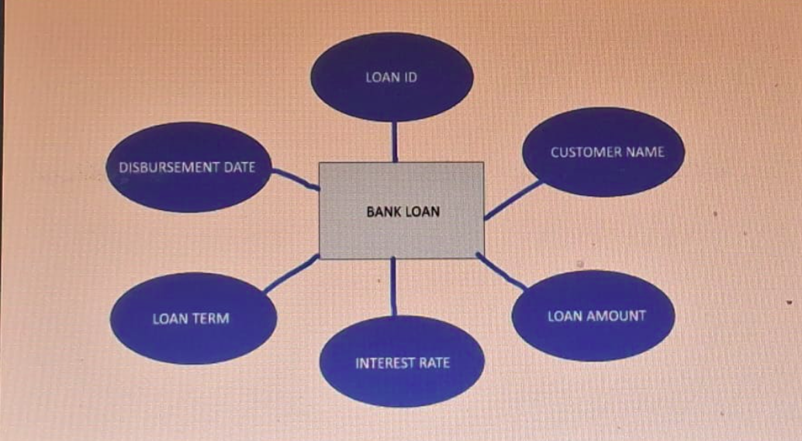
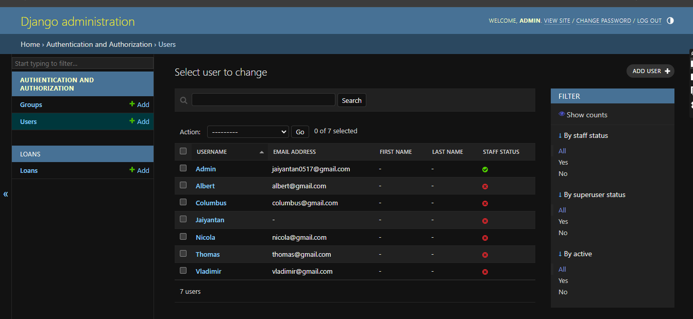
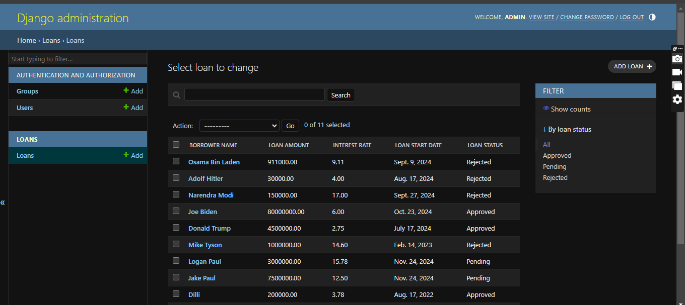

# Ex02 Django ORM Web Application
# Date: 14/10/2024
# AIM
To develop a Django application to store and retrieve data from a bank loan database using Object Relational Mapping(ORM).

# ENTITY RELATIONSHIP DIAGRAM
## DESIGN STEPS
## STEP 1:
Clone the problem from GitHub

## STEP 2:
Create a new app in Django project

## STEP 3:
Enter the code for admin.py and models.py

## STEP 4:
Execute Django admin and create details for 10 books

# PROGRAM:

# admin.py:

    from django.contrib import admin
    from .models import Loan

    @admin.register(Loan)
    class LoanAdmin(admin.ModelAdmin):
        list_display = ('borrower_name', 'loan_amount', 'interest_rate', 'loan_start_date', 'loan_status')
        list_filter = ('loan_status',)
        search_fields = ('borrower_name',)

# models.py:

    from django.db import models

    class Loan(models.Model):
        borrower_name = models.CharField(max_length=255)
        loan_amount = models.DecimalField(max_digits=10, decimal_places=2)
        interest_rate = models.DecimalField(max_digits=4, decimal_places=2)
        loan_start_date = models.DateField()
        loan_status = models.CharField(max_length=50, choices=[
            ('Approved', 'Approved'),
            ('Pending', 'Pending'),
            ('Rejected', 'Rejected')
        ])

        def __str__(self):
            return f"{self.borrower_name} - {self.loan_status}"

# ER DIAGRAM:

# OUTPUT

# RESULT
Thus the program for creating a database using ORM hass been executed successfully
